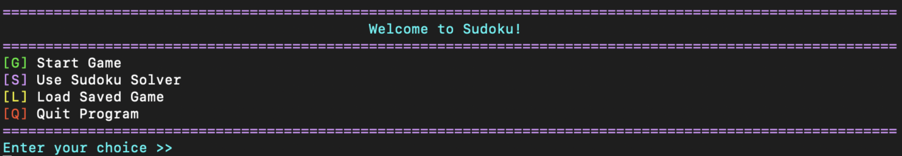
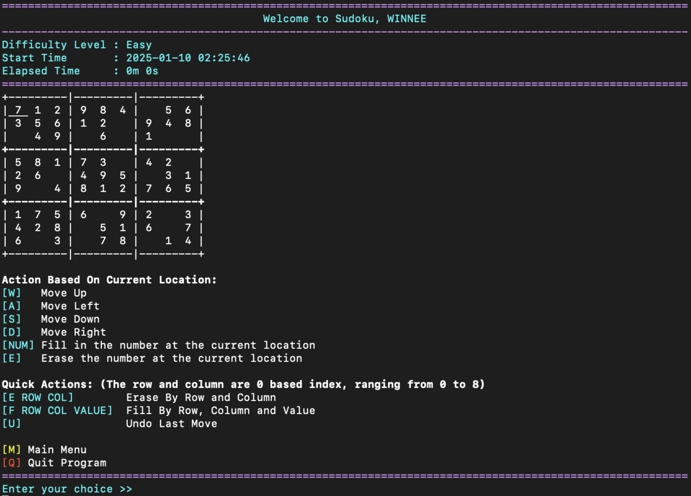
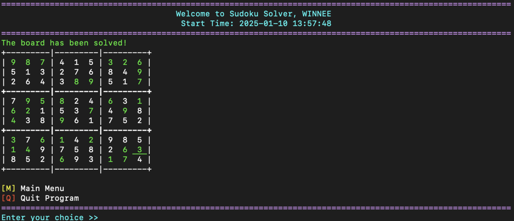
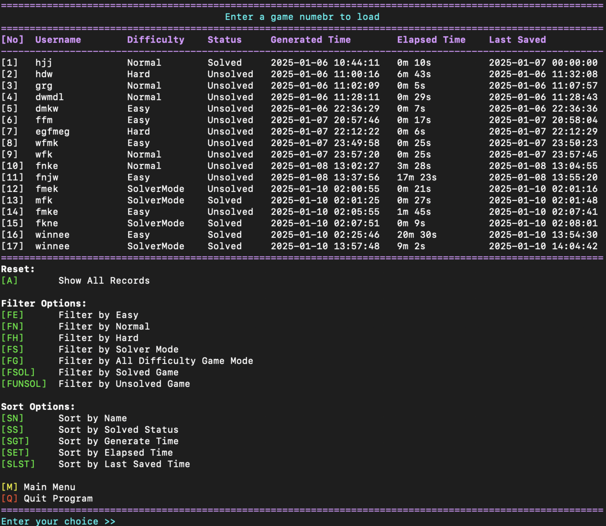

# Sudoku Game in Haskell

A comprehensive Sudoku game and solver implemented in Haskell, featuring both interactive gameplay and automated solving capabilities.

## Program Output









## Features

### 🎮 Game Modes

- **Play Mode**: Interactive Sudoku gameplay with three difficulty levels
  - Easy: 1-3 cells removed per 3x3 box
  - Normal: 4-5 cells removed per 3x3 box
  - Hard: 6-8 cells removed per 3x3 box
- **Solver Mode**: Automated Sudoku solver with backtracking algorithm

### 🎯 Core Functionality

- **Interactive Gameplay**: Navigate with WASD keys, fill/erase cells
- **Quick Actions**: Direct cell manipulation with coordinates
- **Undo System**: Step-by-step game history with undo capability
- **Game Persistence**: Save and load games with CSV-based storage
- **Time Tracking**: Elapsed time calculation and display
- **Validation**: Real-time Sudoku rule validation

### 📊 Game Management

- **Save System**: Save games with metadata (difficulty, time, status)
- **Load System**: Browse, filter, and sort saved games
- **Game Records**: Comprehensive game history management
- **Filtering Options**: Filter by difficulty, solved status, etc.
- **Sorting Options**: Sort by name, time, status, etc.

### 🎨 User Interface

- **Colorized Display**: ANSI color support for better visual experience
- **Interactive Menus**: Intuitive command-based interface
- **Real-time Updates**: Live board display with current position highlighting
- **Formatted Output**: Clean, organized display with proper alignment

## Installation

### Prerequisites

- [Haskell Stack](https://docs.haskellstack.org/en/stable/README/) or [Cabal](https://www.haskell.org/cabal/)
- GHC 9.4.8 or compatible

### Building the Project

1. Clone the repository:

```bash
git clone <repository-url>
cd Sudoku-Haskell
```

2. Build with Cabal:

```bash
cabal build
```

3. Run the executable:

```bash
cabal run a-Winnee0305
```

Or with Stack:

```bash
stack build
stack exec a-Winnee0305
```

## Usage

### Starting the Game

Run the executable to see the main menu:

```
Welcome to Sudoku!
[G] Start Game
[S] Use Sudoku Solver
[L] Load Saved Game
[Q] Quit Program
```

### Game Controls

#### Navigation

- `W` - Move up
- `A` - Move left
- `S` - Move down
- `D` - Move right

#### Cell Manipulation

- `1-9` - Fill number at current position
- `E` - Erase number at current position
- `U` - Undo last move

#### Quick Actions

- `F ROW COL VALUE` - Fill specific cell (0-based coordinates)
- `E ROW COL` - Erase specific cell (0-based coordinates)

#### Solver Mode

- `P` - Solve the entire puzzle automatically

#### General

- `M` - Return to main menu
- `Q` - Quit program

### Game Flow

1. **Enter Name**: Provide a username (2-10 characters)
2. **Select Difficulty**: Choose Easy, Normal, or Hard
3. **Play**: Navigate and fill cells following Sudoku rules
4. **Save/Load**: Manage your game progress
5. **Solve**: Use the solver for hints or complete solutions

## Project Structure

```
app/
├── Main.hs              # Entry point
├── GameFlow.hs          # Game flow and state management
├── GameLogic.hs         # Core game logic and algorithms
├── TypesNUtilities.hs   # Data types and utility functions
├── UserInterface.hs     # Display and formatting
└── GameRecords.csv      # Saved games database
```

### Key Modules

- **GameFlow**: Manages game state transitions and user input processing
- **GameLogic**: Implements Sudoku generation, validation, and solving algorithms
- **TypesNUtilities**: Defines data structures and utility functions
- **UserInterface**: Handles all display formatting and user interaction

## Technical Details

### Architecture

- **Functional Programming**: Pure functions with immutable data structures
- **Monadic I/O**: Clean separation of pure logic and side effects
- **Type Safety**: Strong typing with custom data types for game entities
- **Modular Design**: Well-separated concerns across modules

### Algorithms

- **Sudoku Generation**: Backtracking with random shuffling for puzzle creation
- **Validation**: Row, column, and 3x3 box constraint checking
- **Solver**: Backtracking algorithm with visual progress indication
- **Difficulty Scaling**: Configurable cell removal based on difficulty level

### Data Persistence

- **CSV Format**: Human-readable game records storage
- **Metadata Tracking**: User, difficulty, timing, and solution status
- **Incremental Updates**: Efficient record modification system

## Dependencies

- `base ^>=4.17.2.1` - Haskell standard library
- `directory` - File system operations
- `split` - String splitting utilities
- `time` - Date and time handling
- `random-shuffle` - Random list shuffling
- `random` - Random number generation

## Development

### Building from Source

```bash
cabal configure
cabal build
cabal test  # If tests are available
```

### Code Style

- Follows Haskell best practices
- Comprehensive type annotations
- Extensive documentation comments
- Consistent naming conventions

## License

This project is licensed under the BSD-3-Clause License - see the [LICENSE](LICENSE) file for details.

## Author

**Winnee0305**  
Email: winnee.chew@gmail.com

## Contributing

1. Fork the repository
2. Create a feature branch
3. Make your changes
4. Add tests if applicable
5. Submit a pull request

## Changelog

See [CHANGELOG.md](CHANGELOG.md) for version history and updates.

---

**Enjoy playing Sudoku!** 🧩
